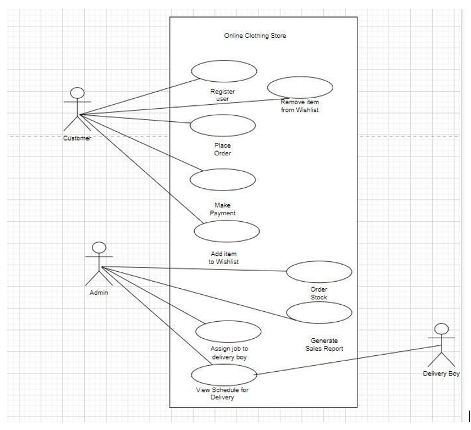

# Araadia Clothing Store

**Team Members:**
- Maria Saeed Ahmed
- Areeba Sattar
- Saad Khan

## Overview

Welcome to the Araadia Clothing Store project repository! This repository documents the functional and non-functional requirements, use cases, user stories, and sprints for the development of an online clothing store system. Araadia Clothing Store aims to provide an efficient and user-friendly platform for users to shop for their favorite clothing items.

## Functional Requirements

1. **User Registration and Login:** Allow users to create accounts and log in using their credentials to access the online store and shop.
2. **Product Catalog:** Manage the addition, deletion, and modification of items available for sale.
3. **Shopping Cart:** Enable users to add items to their cart, view cart items, and proceed to checkout.
4. **Payment Processing:** Process online payments securely by integrating with payment processing services.
5. **Wish List:** Provide users the ability to maintain a wish list for future purchases.
6. **Inventory Management:** Allow administrators to manage inventory, including adding new stock and updating availability.
7. **Integration with Payment Processing Services:** Seamlessly integrate the system with payment gateways for secure transactions.

## Non-Functional Requirements

### Product Requirements

1. **Performance:** Ensure high performance with fast response times, minimal downtime, and efficient server load balancing.
2. **Reliability:** Implement backup plans and mechanisms to ensure the system's reliability.
3. **Security:** Employ robust security measures to protect user data and transactions.
4. **Scalability:** Design the system to be easily scalable without compromising performance.
5. **Usability:** Provide an intuitive user experience with clear instructions and user-friendly interfaces.

### Organizational Requirements

- **Privacy:** Safeguard customer data and ensure it remains private and inaccessible to unauthorized individuals.

### External Requirements

- **Compliance:** Ensure adherence to national and international e-commerce laws and regulations.

## Use Cases

### Use Case Diagram

### Use Case Descriptions

1. **Register User:** New users can create an account by providing personal information.
2. **Order Stock:** Admins can order new stock from suppliers to maintain inventory.
3. **Place Order:** Customers can select items, provide shipping information, make payment, and place orders.
4. **Make Payment:** Customers can select a payment method and make secure online payments.
5. **Generate Sales Report:** Admins can generate reports to analyze sales trends and item popularity.
6. **Add Item to Wish List:** Registered users can add items to their wish list for future purchases.
7. **Remove Item from Wish List:** Users can remove items from their wish list as preferences change.
8. **Assign Job to Delivery Boy:** Admins can assign delivery tasks to delivery staff based on availability.
9. **View Schedule for Delivery (Delivery Boy):** Delivery staff can view their upcoming delivery schedules.
10. **View Schedule for Delivery (Admin):** Admins can view and manage delivery schedules for fairness.
11. **Customer Login:** Registered customers can log in to access their accounts and make purchases.
12. **Admin Login:** Admins can log in to access administrative privileges.
13. **Manage Items:** Admins can manage items, including adding, retrieving, updating, and deleting.

## User Stories

### User Stories for Selected Use Cases

1. **Register User:**
   - As a new user, I want to be able to register for an account so that I can make purchases.

2. **Place Order:**
   - As a customer, I want to be able to place an order so that I can get products of my choice.

3. **Generate Sales Report:**
   - As an Admin, I want to be able to see all the sales that have been made so I can analyze which things sell more and on what day sales are more.

## Sprint Backlog

### 1st Sprint

#### User Story: Register User
- Create user registration form
- Validate user input
- Implement user registration functionality
- Store user registration data in the database

#### User Story: Order Stock
- Place an order with the supplier and confirm the delivery date
- Receive delivery and update the inventory

### 2nd Sprint

#### User Story: Add Item to Wish List
- Implement search functionality for the store
- Implement clicking on a product picture to view product details
- Design product detail pages
- Implement "Add to Wish List" button functionality

#### User Story: Remove Item from Wish List
- Implement functionality to search within the wish list
- Implement functionality to remove items from the wish list

#### User Story: View Schedule for Delivery (Admin)
- Design the user interface for the admin's view of delivery schedules
- Create a database for delivery schedules
- Integrate the UI and the database to retrieve schedules
- Display delivery schedule data on the page

### 3rd Sprint

#### User Story: Place Order
- Design the order placement page
- Implement order placement functionality
- Integrate the "Place Order" functionality with payment processing
- Update the inventory database

#### User Story: Make Payment
- Design the UI for the payment process
- Implement the "Make Payment" functionality
- Update the inventory database

#### User Story: Generate Sales Report
- Design the UI for displaying sales reports
- Retrieve sales data from the database and display it

### Prototyping

